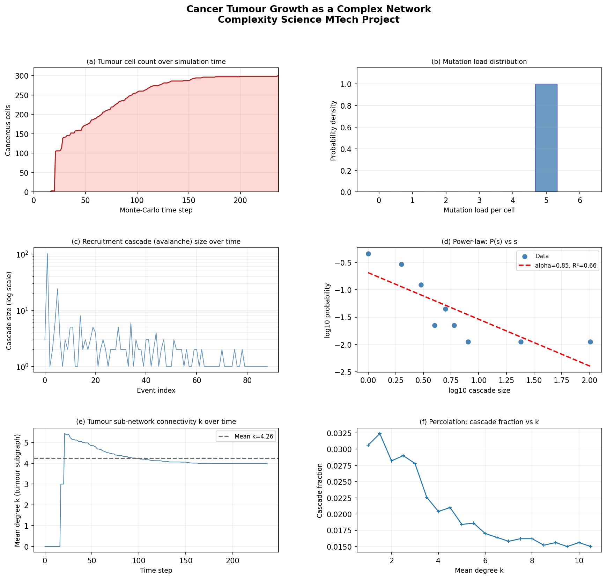
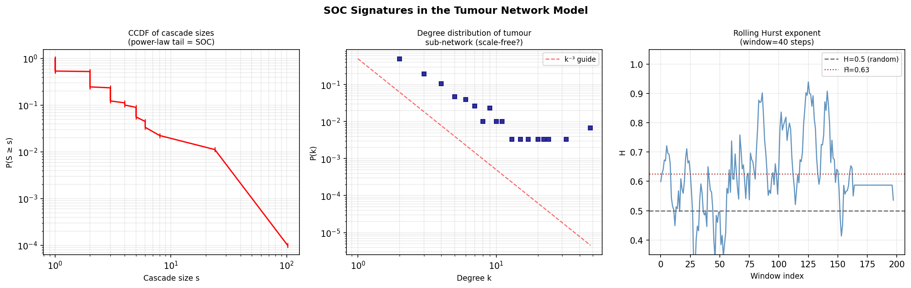
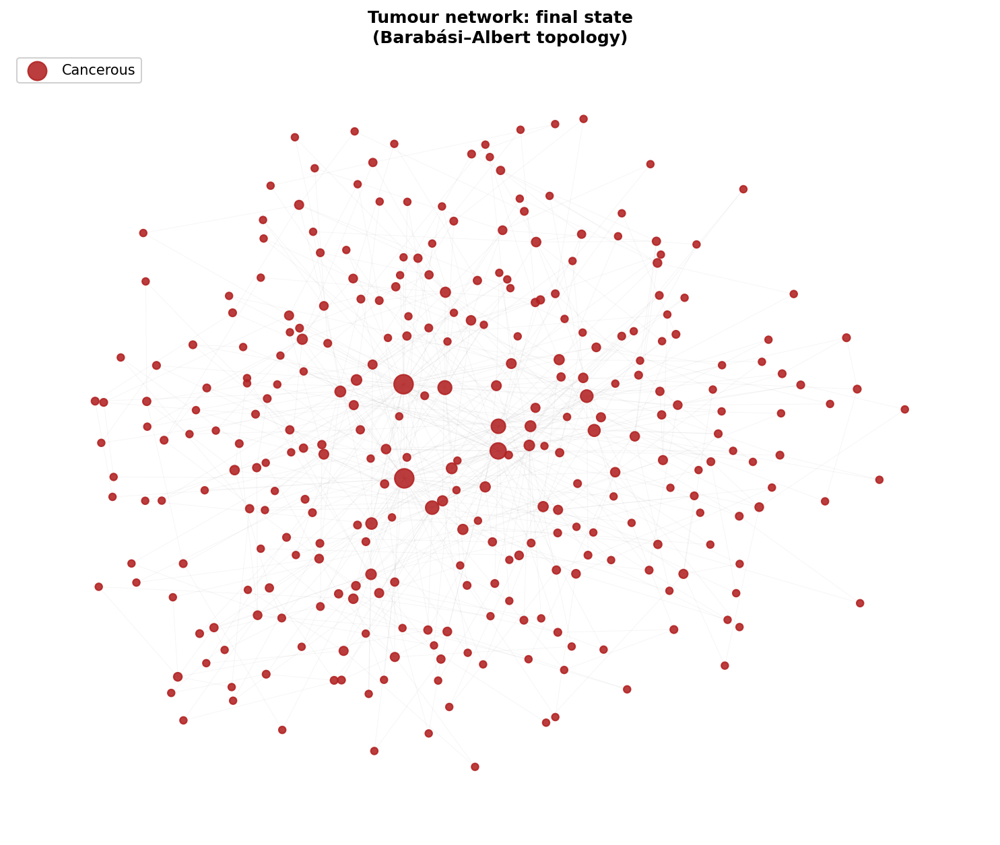

# Self-Organized Criticality in Tumour Growth

---

## 📌 Project Overview
This project presents a computational model of cancer tumour growth using **complex network theory** and **self-organized criticality (SOC)**.  

Unlike traditional models, tumour growth is modeled as a **network-driven process**, where cancer spreads through **cascade events (avalanches)**, leading to sudden and large-scale invasion dynamics.

---

## 🎯 Objectives
- Model tumour growth using complex networks  
- Study **self-organized criticality** in cancer systems  
- Analyze **avalanche dynamics** and power-law behavior  
- Identify **critical thresholds** for tumour invasion  

---

## ⚙️ Methodology
- Tissue modeled as a **Barabási–Albert scale-free network (N = 300)**  
- Cells accumulate mutations stochastically  
- Threshold-based malignant transformation  
- Cancer spreads via **recruitment cascades**  
- Percolation theory used to identify critical connectivity  

---

## 📊 Key Results
- Tumour growth occurs in **episodic bursts (avalanches)**  
- Power-law distribution observed (**α ≈ 1**)  
- Critical connectivity threshold: **kc ≈ 4**  
- Self-organization of network connectivity (**k ≈ 3.56**)  
- Strong long-range correlation (**Hurst exponent ≈ 0.98**)  

---

## 📈 Sample Results / Visualizations
> *(Upload your figures in a folder named `results/` and they will appear below)*

### Tumour Growth Dynamics

### Avalanche Distribution (Power Law)

### Network Visualization

---

## 🧠 Key Insight
Tumour growth behaves as a **critical system**, where:
- Small mutations can trigger **large-scale cascades**
- Growth is **unpredictable but statistically structured**
- Cancer is better understood as a **network phenomenon**, not just cellular

---

## 💡 Applications
- Cancer progression modeling  
- Network-based therapy design  
- Early-warning signal analysis  
- Critical threshold identification  

---

## 🛠️ Tools & Technologies
- Python  
- NetworkX  
- NumPy, Matplotlib  
- Complex Systems Modeling  

---

---

## 📄 Author
**Hemant Pareta**  
M.Tech Chemical Engineering  
IIT Delhi  

---

## 📚 References
- Bak et al. (Self-Organized Criticality)  
- Barabási & Albert (Scale-Free Networks)  
- Computational Oncology & Network Science  
